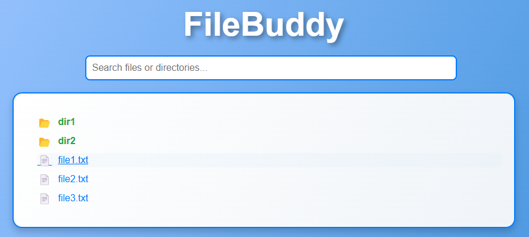

# FileBuddy

FileBuddy is a user-friendly and secure application that allows users to browse, navigate, and download files from a directory structure via a sleek web interface.



## Features

- **Directory Navigation**: Navigate through folders in a visually intuitive tree view.
- **File Downloads**: Download individual files with a single click.
- **Directory Downloads**: Download entire directories as `.zip` files by double-clicking.
- **Responsive Design**: Optimized for both desktop and mobile devices.
- **Cross-Platform Compatibility**: Works seamlessly on Windows, macOS, and Linux.

## Tech Stack

- **Frontend**: HTML, CSS, JavaScript
- **Backend**: Python with Flask
- **Deployment**: Docker support for simplified deployment

## Installation

### Prerequisites

- Python 3.x installed
- Flask library (`pip install flask`)

### Steps

1. Clone the repository:
    ```bash
    git clone https://github.com/your-username/filebuddy.git
    cd filebuddy
    ```
2. Start the Flask server:
    ```bash
    python server.py --base-dir /path/to/files --password yourpassword
    ```
3. Access the application in your browser:
    ```plaintext
    http://127.0.0.1:5000
    ```

### Docker Deployment

1. Build the Docker image:
    ```bash
    cd filebuddy
    docker build -t filebuddy .
    ```
2. Run the container:
    ```bash
    docker run -p 5000:5000 -v /path/to/host/files:/app/files filebuddy
    ```
3. Access the application in your browser:
    ```plaintext
    http://127.0.0.1:5000
    ```

### Usage

1. Open the application in your browser.
2. Browse the directory structure presented in the tree view.
3. Click a file to download it. A green checkmark will appear to confirm the download.
4. Double-click a directory to download its contents as a .zip file.

### Customization
* Directory to Serve: Specify the directory using the --base-dir argument when starting the server.

### License
This project is licensed under the MIT License. See the LICENSE file for more details.
